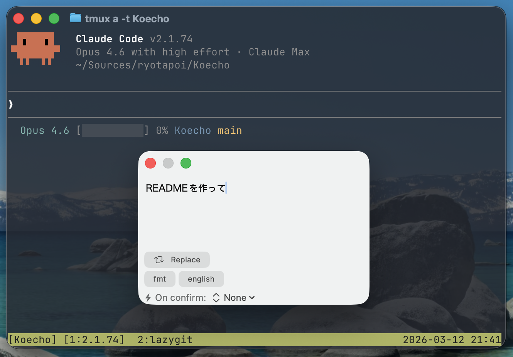

# Koecho（こえこ）

macOS 向けの音声入力+キーボード入力アプリ。
ホットキーで呼び出し、入力したテキストをシェルスクリプトで加工してペーストする。



## 特徴

- 音声入力+キーボード: 音声で入力しながらキーボードで修正できる。認識結果はリアルタイムに反映
- macOS 標準の Dictation を活用: 追加の音声認識エンジンは不要。句読点や改行も音声で入力できる（macOS 26+ では Speech フレームワークによるエンジンも選択可能）
- スクリプト連携: 入力テキストをシェルスクリプトで自由に加工。Claude Code のヘッドレスモードと組み合わせて、音声書き起こしの整形や翻訳を自動化できる

## 動作環境

- macOS 14.0（Sonoma）以上
- SpeechAnalyzer エンジンは macOS 26 以上

## インストール

### GitHub Release から

1. [Releases](https://github.com/ryotapoi/Koecho/releases) から最新の zip をダウンロード
2. 解凍して `Koecho.app` を `/Applications` に移動
3. 初回起動時に「開発元を検証できません」と表示される（Apple Developer ID で署名されていないため）
   - Koecho.app を右クリック →「開く」を選択
   - 確認ダイアログで「開く」をクリック
   - 2回目以降は通常通り起動できる

### ソースからビルド

```bash
git clone https://github.com/ryotapoi/Koecho.git
cd Koecho
open Koecho.xcodeproj
```

Xcode でビルドしてください。

## 必要な権限

初回起動時にシステムから権限の許可を求められます。

- **アクセシビリティ** — テキストのペースト、フォアグラウンドアプリの選択テキスト取得に必要
- **Input Monitoring** — グローバルホットキーの検知に必要
- **マイク**（SpeechAnalyzer 使用時）— オンデバイス音声認識に必要

## 使い方

### 基本フロー

1. ホットキー（デフォルト: Fn キー）でフローティングウィンドウを表示
2. 音声またはキーボードでテキストを入力
3. 必要に応じてスクリプトを実行（テキストがその場で置き換わる）
4. ホットキー再押下で確定 → フォアグラウンドアプリにペースト
5. Escape でキャンセル

### スクリプト連携

設定画面でシェルスクリプトを登録できます。スクリプトは `/bin/sh -c` で実行され、stdin にテキスト全文を受け取り、stdout に加工結果を返します。

環境変数でコンテキスト情報も渡されます:

| 環境変数 | 内容 |
|---------|------|
| `KOECHO_SELECTION` | フォアグラウンドアプリの選択テキスト |
| `KOECHO_PROMPT` | スクリプト実行時の追加入力 |
| `KOECHO_SELECTION_START` | 選択範囲の開始位置 |
| `KOECHO_SELECTION_END` | 選択範囲の終了位置 |

動作確認には `examples/echo-env.sh` を使ってください。登録して実行すると、stdin の内容と環境変数の値が表示されます。

### Claude Code による音声テキスト整形

`examples/claude-fmt.sh` は、Claude Code のヘッドレスモード（`claude -p`）で音声書き起こしを整形するサンプルスクリプトです。実行速度を優先して Haiku モデルを使用しており、Haiku でも結果が安定するようプロンプトを調整しています。

```bash
# デフォルト（日本語整形）
examples/claude-fmt.sh

# 英訳プリセット
examples/claude-fmt.sh e
```

プリセットファイル（`examples/claude-textfmt/*.md`）を `~/.config/claude-textfmt/` にコピーして使います。プリセットを追加すれば、用途に応じた加工パターンを切り替えられます。

## ライセンス

[MIT License](LICENSE)
